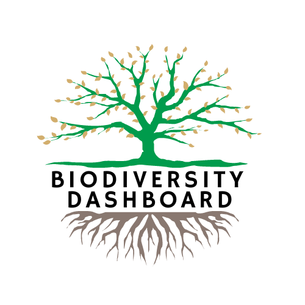

<!-- Improved compatibility of back to top link: See: https://github.com/othneildrew/Best-README-Template/pull/73 -->

<!--
*** Thanks for checking out the Best-README-Template. If you have a suggestion
*** that would make this better, please fork the repo and create a pull request
*** or simply open an issue with the tag "enhancement".
*** Don't forget to give the project a star!
*** Thanks again! Now go create something AMAZING! :D
-->

<!-- PROJECT SHIELDS -->
<!--
*** I'm using markdown "reference style" links for readability.
*** Reference links are enclosed in brackets [ ] instead of parentheses ( ).
*** See the bottom of this document for the declaration of the reference variables
*** for contributors-url, forks-url, etc. This is an optional, concise syntax you may use.
*** https://www.markdownguide.org/basic-syntax/#reference-style-links
-->
# IBM Call for Code 2022 Submission
<!-- PROJECT LOGO -->
 

  

  <h3 align="center">Biodiversity Dashboard for Reforestation Projects</h3>

  <!-- 

    An awesome README template to jumpstart your projects!
     
    <a href="https://github.com/othneildrew/Best-README-Template"><strong>Explore the docs »</strong></a>
     
     
    <a href="https://github.com/othneildrew/Best-README-Template">View Demo</a>
    ·
    <a href="https://github.com/othneildrew/Best-README-Template/issues">Report Bug</a>
    ·
    <a href="https://github.com/othneildrew/Best-README-Template/issues">Request Feature</a>
  
 -->

<!-- TABLE OF CONTENTS -->

  
Table of Contents

  <ol>
    <li>
      <a href="#about-the-project">About The Project</a>
      <ul>
        <li><a href="#built-with">Built With</a></li>
      </ul>
    </li>
    <li>
      <a href="#getting-started">Getting Started</a>
      <ul>
        <li><a href="#prerequisites">Prerequisites</a></li>
        <li><a href="#installation">Installation</a></li>
      </ul>
    </li>
    <li><a href="#team">Team</a></li>
    <li><a href="#acknowledgments">Acknowledgments</a></li>
  </ol>

<!-- ABOUT THE PROJECT -->
## About The Project

Using machine learning to generate data that is aggregated and shared via a dashboard to measure the impacts of reforestation projects on biodiversity.

### The Issue

Data showing the co-benefits of reforestation projects need to be accurately measured and analysed in an easy-to-understand format to increase trust and transparency in voluntary carbon markets. Currently, a lack of good data is keeping capital from going to projects that increase biodiversity, social impacts, and carbon sequestration.

### The Solution

Data, such as satellite images, acoustic sensors, and camera traps, need to be analysed by machine learning and artificial intelligence to figure out what kinds of species are there. This data can be used to look at the trend of biodiversity and how it changes over time. A digestible dashboard provides transparency to investors and stakeholders, such as governments and non-governmental organisations. This transparency promotes investment into biodiversity projects with a clearer ROI.

### Built With

* IBM Watson Studio
* Juypter Notebook
* Python
* Tensorflow
* Flask API

### Proposed System Diagram
 

(<a href="#readme-top">back to top</a>)

<!-- GETTING STARTED -->
## Getting Started

Please run the following two scripts in order:

`pip install -r requirements.txt`

`python3 app.py`

### Prerequisites

This program will only run on a Windows machine.

You must have python3 installed on your system.

(<a href="#readme-top">back to top</a>)

<!-- TEAM -->
## Team

* Rupen Patel [Communicator]
* Gerry Korfiatis [Builder]
* Kshitij Tiwari [Builder]
* Ajmal N [Builder]
* Suraj Patil [Builder]
* Badmaarag Jargalsaikhan [Communicator]

(<a href="#readme-top">back to top</a>)

<!-- MARKDOWN LINKS & IMAGES -->
<!-- https://www.markdownguide.org/basic-syntax/#reference-style-links -->
[contributors-shield]: https://img.shields.io/github/contributors/othneildrew/Best-README-Template.svg?style=for-the-badge
[contributors-url]: https://github.com/othneildrew/Best-README-Template/graphs/contributors
[forks-shield]: https://img.shields.io/github/forks/othneildrew/Best-README-Template.svg?style=for-the-badge
[forks-url]: https://github.com/othneildrew/Best-README-Template/network/members
[stars-shield]: https://img.shields.io/github/stars/othneildrew/Best-README-Template.svg?style=for-the-badge
[stars-url]: https://github.com/othneildrew/Best-README-Template/stargazers
[issues-shield]: https://img.shields.io/github/issues/othneildrew/Best-README-Template.svg?style=for-the-badge
[issues-url]: https://github.com/othneildrew/Best-README-Template/issues
[license-shield]: https://img.shields.io/github/license/othneildrew/Best-README-Template.svg?style=for-the-badge
[license-url]: https://github.com/othneildrew/Best-README-Template/blob/master/LICENSE.txt
[linkedin-shield]: https://img.shields.io/badge/-LinkedIn-black.svg?style=for-the-badge&logo=linkedin&colorB=555
[linkedin-url]: https://linkedin.com/in/othneildrew
[product-screenshot]: images/screenshot.png
[Next.js]: https://img.shields.io/badge/next.js-000000?style=for-the-badge&logo=nextdotjs&logoColor=white
[Next-url]: https://nextjs.org/
[React.js]: https://img.shields.io/badge/React-20232A?style=for-the-badge&logo=react&logoColor=61DAFB
[React-url]: https://reactjs.org/
[Vue.js]: https://img.shields.io/badge/Vue.js-35495E?style=for-the-badge&logo=vuedotjs&logoColor=4FC08D

[Vue-url]: https://vuejs.org/
[Angular.io]: https://img.shields.io/badge/Angular-DD0031?style=for-the-badge&logo=angular&logoColor=white
[Angular-url]: https://angular.io/
[Svelte.dev]: https://img.shields.io/badge/Svelte-4A4A55?style=for-the-badge&logo=svelte&logoColor=FF3E00
[Svelte-url]: https://svelte.dev/
[Laravel.com]: https://img.shields.io/badge/Laravel-FF2D20?style=for-the-badge&logo=laravel&logoColor=white
[Laravel-url]: https://laravel.com
[Bootstrap.com]: https://img.shields.io/badge/Bootstrap-563D7C?style=for-the-badge&logo=bootstrap&logoColor=white
[Bootstrap-url]: https://getbootstrap.com
[JQuery.com]: https://img.shields.io/badge/jQuery-0769AD?style=for-the-badge&logo=jquery&logoColor=white
[JQuery-url]: https://jquery.com 

[IBM-Watson-Studio]: https://ibm.github.io/watson-studio-workshop/housing-price-predictor/assets/watson_logo.png
[IBM-Watson-Studio-url]: https://www.ibm.com/au-en/cloud/watson-studio

[Tensorflow]: https://www.gstatic.com/devrel-devsite/prod/vbad39f885886bc440e53563b954be5bc119ad9455e9fd347968d0509a569587a/tensorflow/images/lockup.svg
[Tensorflow-url]: https://www.tensorflow.org

[Python]: https://www.python.org/static/img/python-logo@2x.png
[Python-url]: https://www.python.org
